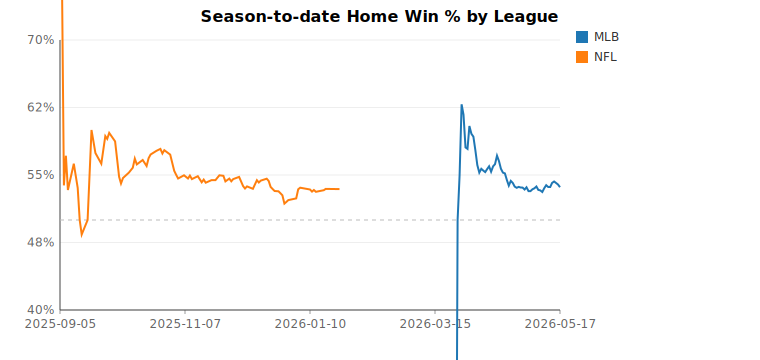
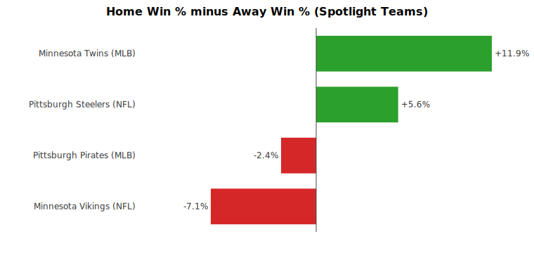
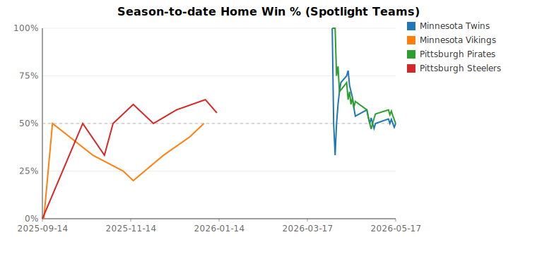

# Home Field Advantage Report (2026-05-17)

## League Summary

| League | Games | Home Win % | Avg Home Margin |
|---|---:|---:|---:|
| MLB | 699 | 53.6% | +0.13 |
| NFL | 277 | 53.4% | +2.20 |

## Team Summary (Top 15 by Home Win %)

| Team | Home Games | Home Win % | Avg Home Margin |
|---|---:|---:|---:|
| Los Angeles Rams | 8 | 87.5% | +10.75 |
| Denver Broncos | 11 | 81.8% | +6.36 |
| Seattle Seahawks | 10 | 80.0% | +12.20 |
| Chicago Cubs | 23 | 78.3% | +1.87 |
| Jacksonville Jaguars | 9 | 77.8% | +13.67 |
| Buffalo Bills | 9 | 77.8% | +7.78 |
| Houston Texans | 9 | 77.8% | +8.22 |
| Tampa Bay Rays | 21 | 76.2% | +0.90 |
| New England Patriots | 11 | 72.7% | +10.45 |
| New York Yankees | 20 | 70.0% | +2.40 |
| Chicago Bears | 10 | 70.0% | +6.50 |
| Atlanta Braves | 24 | 66.7% | +1.54 |
| Milwaukee Brewers | 24 | 62.5% | +2.04 |
| Indianapolis Colts | 8 | 62.5% | +7.12 |
| Green Bay Packers | 8 | 62.5% | +4.12 |

## Spotlight: Minnesota & Pittsburgh

| Team | League | Home | Home Win % | Away | Away Win % | HFA Lift | Streak | Last 10 (Home) |
|---|---|---:|---:|---:|---:|---:|---:|---|
| Minnesota Twins | MLB | 13-13 | 50.0% | 8-13 | 38.1% | +11.9% | 6W max | `WLLWWLWLLW` |
| Minnesota Vikings | NFL | 4-4 | 50.0% | 4-3 | 57.1% | -7.1% | 3W max | `LWLLLWWW` |
| Pittsburgh Pirates | MLB | 13-13 | 50.0% | 11-10 | 52.4% | -2.4% | 4W max | `LWWWWLWLLL` |
| Pittsburgh Steelers | NFL | 5-4 | 55.6% | 4-4 | 50.0% | +5.6% | 2W max | `LWLWWLWWL` |

### Biggest home wins

- **Minnesota Twins** beat Miami Marlins by 8 on 2026-05-14
- **Minnesota Vikings** beat Cincinnati Bengals by 38 on 2025-09-21
- **Pittsburgh Pirates** beat Washington Nationals by 11 on 2026-04-13
- **Pittsburgh Steelers** beat Cincinnati Bengals by 22 on 2025-11-16

