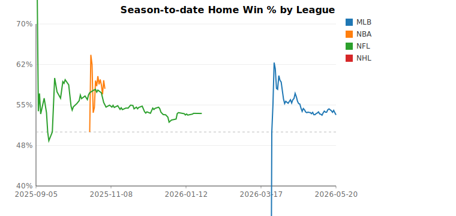
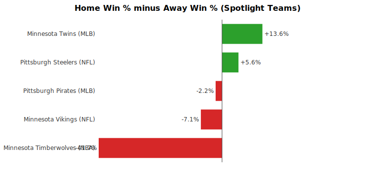
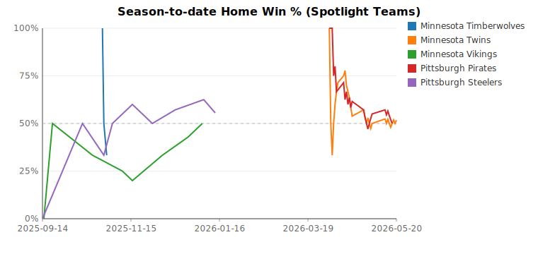

# Home Field Advantage Report (2026-05-21)

## League Summary

| League | Games | Home Win % | Avg Home Margin |
|---|---:|---:|---:|
| MLB | 743 | 53.2% | +0.06 |
| NBA | 100 | 58.0% | +2.12 |
| NFL | 277 | 53.4% | +2.20 |
| NHL | 2 | 0.0% | -1.50 |

## Team Summary (Top 15 by Home Win %)

| Team | Home Games | Home Win % | Avg Home Margin |
|---|---:|---:|---:|
| Oklahoma City Thunder | 4 | 100.0% | +14.25 |
| New York Knicks | 4 | 100.0% | +11.75 |
| Chicago Bulls | 4 | 100.0% | +8.00 |
| Golden State Warriors | 3 | 100.0% | +12.67 |
| LA Clippers | 3 | 100.0% | +12.00 |
| San Antonio Spurs | 3 | 100.0% | +11.67 |
| Denver Nuggets | 2 | 100.0% | +28.00 |
| Miami Heat | 2 | 100.0% | +17.50 |
| Los Angeles Rams | 8 | 87.5% | +10.75 |
| Denver Broncos | 11 | 81.8% | +6.36 |
| Seattle Seahawks | 10 | 80.0% | +12.20 |
| Tampa Bay Rays | 24 | 79.2% | +1.42 |
| Jacksonville Jaguars | 9 | 77.8% | +13.67 |
| Buffalo Bills | 9 | 77.8% | +7.78 |
| Houston Texans | 9 | 77.8% | +8.22 |

## Spotlight: Minnesota & Pittsburgh

| Team | League | Home | Home Win % | Away | Away Win % | HFA Lift | Streak | Last 10 (Home) |
|---|---|---:|---:|---:|---:|---:|---:|---|
| Minnesota Timberwolves | NBA | 1-2 | 33.3% | 3-1 | 75.0% | -41.7% | 1W max | `WLL` |
| Minnesota Twins | MLB | 15-14 | 51.7% | 8-13 | 38.1% | +13.6% | 6W max | `WWLWLLWWLW` |
| Minnesota Vikings | NFL | 4-4 | 50.0% | 4-3 | 57.1% | -7.1% | 3W max | `LWLLLWWW` |
| Pittsburgh Pirates | MLB | 13-13 | 50.0% | 12-11 | 52.2% | -2.2% | 4W max | `LWWWWLWLLL` |
| Pittsburgh Steelers | NFL | 5-4 | 55.6% | 4-4 | 50.0% | +5.6% | 2W max | `LWLWWLWWL` |

### Biggest home wins

- **Minnesota Timberwolves** beat Indiana Pacers by 4 on 2025-10-26
- **Minnesota Twins** beat Miami Marlins by 8 on 2026-05-14
- **Minnesota Vikings** beat Cincinnati Bengals by 38 on 2025-09-21
- **Pittsburgh Pirates** beat Washington Nationals by 11 on 2026-04-13
- **Pittsburgh Steelers** beat Cincinnati Bengals by 22 on 2025-11-16

